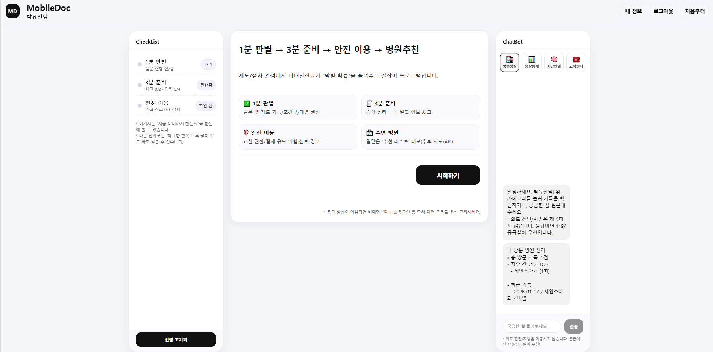
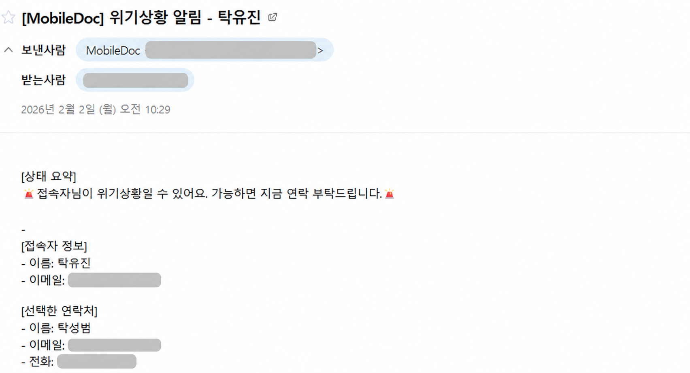
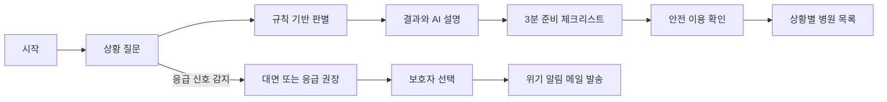

# MobileDoc Frontend

> 비대면 진료를 시작하기 전, 사용자가 자신의 상황을 확인하고 필요한 준비와 다음 행동을 이해할 수 있도록 만든 React 서비스입니다.

[](https://react.dev/)
[](https://developer.mozilla.org/ko/docs/Web/JavaScript)
[](https://vite.dev/)
[](https://developer.mozilla.org/ko/docs/Web/CSS)

## 프로젝트 소개

MobileDoc는 비대면 진료가 가능한지 알기 어려운 사용자를 위해 질문, 판별 결과, 준비 체크리스트, 안전 확인, 병원 목록을 하나의 흐름으로 연결한 개인 풀스택 프로젝트입니다.

단순히 결과만 보여주는 화면보다 사용자가 지금 무엇을 해야 하는지 알 수 있는 화면을 만들고 싶었습니다. 그래서 질문을 한 번에 모두 노출하지 않고 답변에 따라 필요한 질문만 보여주었으며, 결과 화면에는 판별 이유와 병원에 확인할 질문을 함께 배치했습니다. 응급 신호가 선택되면 일반 흐름을 중단하고 대면 진료 또는 응급 도움을 우선 안내합니다.

| 구분 | 내용 |
| --- | --- |
| 개발 형태 | 개인 프로젝트, 기획부터 프론트엔드와 백엔드 구현까지 담당 |
| 개발 기간 | 2025.12 - 2026.02 |
| 프론트엔드 | React 19, JavaScript, Vite, CSS |
| 백엔드 연동 | Spring Boot REST API, MySQL, OpenAI Responses API, SMTP |
| 관련 저장소 | [Frontend](https://github.com/ttyujin/MobileDoc-FE) / [Backend](https://github.com/ttyujin/MobileDoc-BE) |
| 화면 설계 | [Figma](https://www.figma.com/design/IrQ2dcEyOLBmGXVym3SwXw/%EB%B9%84%EB%8C%80%EB%A9%B4-3%EB%B6%84-%EC%B2%B4%ED%81%AC-%EB%A6%AC%EC%8A%A4%ED%8A%B8?t=88Yl3AC7xJcY8QK2-1) |

## 서비스 화면

### 1. 시작 화면

왼쪽에는 현재 진행 단계를, 가운데에는 해야 할 일을, 오른쪽에는 챗봇을 배치했습니다. 사용자가 화면을 이동해도 전체 진행 상황을 놓치지 않도록 구성했습니다.



### 2. 판별 결과 화면

결과를 `가능`, `조건부 가능`, `대면 권장`으로 구분하고 판별 근거, 자세한 설명, 병원에 확인할 질문을 한 화면에 보여줍니다. 설명 길이는 간단, 보통, 자세히 중에서 선택할 수 있습니다.


### 3. 위기 상황 이메일 발송

응급 흐름에서 사용자가 저장한 연락처를 선택하면 프론트엔드가 백엔드의 위기 알림 API를 호출합니다. 접속자 정보와 선택한 연락처가 포함된 이메일이 실제로 발송되는 것까지 확인했습니다.

개인정보 보호를 위해 아래 화면의 이메일 주소와 전화번호는 가렸습니다.



## 사용자 흐름



## 프론트엔드에서 해결한 문제

### 1. 답변에 따라 필요한 질문만 보여주었습니다

비대면 가능 방식, 진료 목적, 증상, 심각도, 재진 여부, 처방 필요 여부를 순서대로 묻습니다. 이전 답변에 따라 다음 질문을 조건부로 노출하여 사용자가 불필요한 항목까지 읽지 않도록 했습니다.

예를 들어 재진을 선택한 경우에만 같은 병원인지 묻고, 처방이 필요한 경우에만 약 수령 방식을 확인합니다. 응급 신호를 선택하면 나머지 질문을 진행하지 않고 즉시 대면 또는 응급 권장 결과로 이동합니다.

### 2. 판별 로직과 AI 설명을 나누었습니다

`decisionEngine.js`에서 입력값을 기준으로 먼저 결과를 계산합니다.

- 응급 신호가 있으면 대면 또는 응급 권장
- 비대면 방식 이용이 어렵거나 일상생활이 불가능할 정도이면 대면 권장
- 같은 기관 재진이거나 재처방, 결과 상담이면 가능성 높음
- 새 증상, 악화 중, 처방 조건 등이 있으면 조건부 가능

프론트엔드는 판별 수준과 근거를 `/ai/explain-decision`에 전달합니다. AI는 새로운 결론을 만드는 것이 아니라 이미 계산된 결과를 사용자가 이해하기 쉬운 설명으로 바꾸는 역할만 담당합니다.

### 3. 결과 이후의 행동까지 연결했습니다

판별 결과를 보여주는 데서 끝내지 않고 다음 기능으로 이어지도록 구성했습니다.

- 결과 근거와 상세 설명
- 병원에 확인할 질문 3개
- 상황별 3분 준비 체크리스트
- 계좌, 원격, 결제, 권한 등 위험 단어 감지
- 결과에 따라 대면 병원 또는 비대면 진료 병원 목록 분기
- 체크리스트 요약 이메일 전송

### 4. 화면 옆에서 계속 사용할 수 있는 챗봇을 만들었습니다

오른쪽 챗봇에서 방문 병원, 증상 통계, 최근 판별, 고객센터 항목을 바로 선택할 수 있습니다. 현재 사용자와 판별 결과를 API 요청의 context로 전달하여 화면에 없는 정보를 AI가 임의로 만들지 않도록 했습니다.

대화 내용과 마지막 선택 항목은 사용자별 `localStorage`에 저장됩니다. 백엔드 연결이 되지 않을 때는 기본 안내를 보여주어 전체 화면이 멈추지 않도록 처리했습니다.

### 5. 계정과 사용자 정보를 하나의 흐름으로 연결했습니다

- 이메일 인증을 포함한 회원가입
- 로그인과 이름 기반 이메일 찾기
- 이메일 인증번호를 이용한 비밀번호 재설정
- 기본 정보, 복용약, 알레르기, 방문 기록, 비상 연락처 저장
- 로그인 후 프로필과 방문 기록 불러오기
- 저장된 정보를 질문과 체크리스트에 다시 활용

## 화면 구성

```text
┌─────────────────────────────────────────────────────────────┐
│ Header: 서비스명, 내 정보, 로그인 상태                      │
├──────────────┬───────────────────────────┬──────────────────┤
│ 진행 단계    │ 현재 작업                 │ ChatBot          │
│              │                           │                  │
│ 1분 판별     │ 질문                      │ 방문 병원        │
│ 3분 준비     │ 결과와 이유               │ 증상 통계        │
│ 안전 이용    │ 체크리스트                │ 최근 판별        │
│              │ 병원 목록                 │ 고객센터         │
└──────────────┴───────────────────────────┴──────────────────┘
```

화면 폭이 1200px 이하일 때는 3열 구성을 1열로 바꾸고, 작은 화면에서는 주요 버튼을 세로로 배치합니다.

## 백엔드 연결

프론트엔드의 API 호출은 `src/mobiledoc/api.js`에서 공통 처리합니다. 현재 기본 주소는 `http://localhost:8081`입니다.

| Method | Endpoint | 사용 화면 |
| --- | --- | --- |
| `POST` | `/ai/explain-decision` | 판별 결과의 AI 설명 생성 |
| `POST` | `/ai/chat` | 사용자 context를 이용한 챗봇 응답 |
| `POST` | `/auth/email/send-code` | 회원가입과 비밀번호 재설정 인증번호 발송 |
| `POST` | `/auth/email/verify-code` | 회원가입 이메일 인증 |
| `POST` | `/auth/signup` | 회원가입 |
| `POST` | `/auth/login` | 로그인 |
| `POST` | `/auth/find-email` | 이름을 이용한 이메일 찾기 |
| `POST` | `/auth/password/reset-with-code` | 비밀번호 재설정 |
| `GET` | `/profile/{userId}` | 사용자 프로필 조회 |
| `PUT` | `/profile/{userId}` | 사용자 프로필 저장 |
| `GET` | `/stats/symptoms` | 최근 증상 통계 조회 |
| `POST` | `/alerts/checklist` | 체크리스트 요약 이메일 전송 |
| `POST` | `/alerts/emergency` | 보호자와 관리자에게 위기 상황 알림 전송 |

## 기술 스택

| 영역 | 사용 기술 |
| --- | --- |
| UI | React 19.2, JSX |
| Language | JavaScript ES6+ |
| Build Tool | Vite 7.2 |
| Styling | CSS, Flexbox, CSS Grid, Media Query |
| Server State | Fetch API, 공통 `apiGet`, `apiPost`, `apiPut` 함수 |
| Local State | React Hooks, localStorage |
| Code Quality | ESLint |
| Package Tooling | Node.js, npm |

## 프로젝트 구조

```text
src/mobiledoc
├── components
│   ├── ChatbotPanel.jsx
│   ├── Header.jsx
│   ├── SideChecklistPanel.jsx
│   ├── StepQuestions.jsx
│   ├── StepResult.jsx
│   ├── StepChecklist.jsx
│   ├── StepSafety.jsx
│   ├── StepHospitals.jsx
│   ├── StepTeleHospitals.jsx
│   ├── StepLogin.jsx
│   ├── StepSignup.jsx
│   └── StepProfileSetup.jsx
├── data
│   ├── questions.js
│   └── mockHospitals.js
├── logic
│   ├── decisionEngine.js
│   └── checklist.js
├── styles
│   ├── base.css
│   ├── layout.css
│   ├── steps.css
│   └── ui.css
├── utils
│   └── riskSignals.js
├── api.js
└── MobileDoc.jsx
```

## 실행 방법

### 1. 사전 준비

- Node.js 20 이상
- npm
- AI 설명, 로그인, 이메일 기능을 사용하려면 [MobileDoc-BE](https://github.com/ttyujin/MobileDoc-BE) 실행 필요

### 2. 설치와 실행

```bash
git clone https://github.com/ttyujin/MobileDoc-FE.git
cd MobileDoc-FE
npm install
npm run dev
```

터미널에 표시된 주소로 접속합니다. 일반적으로 `http://localhost:5173`에서 실행됩니다.

백엔드 연결이 필요한 기능을 확인하려면 MobileDoc-BE를 `http://localhost:8081`에서 먼저 실행해야 합니다.

### 3. 코드 검사와 빌드

```bash
npm run lint
npm run build
npm run preview
```

## 개발 방식

먼저 Claude를 이용해 질문 순서, 사용자 상태, 예외 흐름을 정리했습니다. 그 내용을 Figma 화면으로 옮기면서 사용자가 다음에 무엇을 해야 하는지 한눈에 보이는지 확인했고, 이후 React와 JavaScript로 화면을 구현했습니다.

프론트엔드 화면이 완성된 뒤 필요한 요청값과 응답값을 기준으로 Spring Boot API를 연결했습니다. Codex는 구현 중 발생한 오류의 원인을 찾고 수정 방향을 검토할 때 활용했습니다. 제안된 코드는 직접 실행하고, 질문 분기와 API 응답, 오류 상황을 다시 확인한 뒤 반영했습니다.

## 다음 개선 계획

- 하드코딩된 API 주소를 Vite 환경 변수로 분리
- JavaScript 코드를 TypeScript로 단계적으로 전환
- Vitest와 React Testing Library로 질문 분기와 판별 화면 테스트 작성
- Playwright로 회원가입부터 결과, 이메일 알림까지 전체 흐름 테스트
- 키보드 탐색, 포커스 표시, 스크린 리더 안내를 포함한 접근성 점검
- 목업 병원 목록을 실제 위치 기반 병원 API와 연결

## 의료 안전 안내

MobileDoc는 의료 진단이나 처방을 제공하는 서비스가 아닙니다. 증상이 심하거나 응급 상황이 의심되면 비대면 안내보다 119 또는 응급실의 도움을 먼저 받아야 합니다.

## 만든 사람

탁유진

- GitHub: [github.com/ttyujin](https://github.com/ttyujin)
- Frontend: [MobileDoc-FE](https://github.com/ttyujin/MobileDoc-FE)
- Backend: [MobileDoc-BE](https://github.com/ttyujin/MobileDoc-BE)
